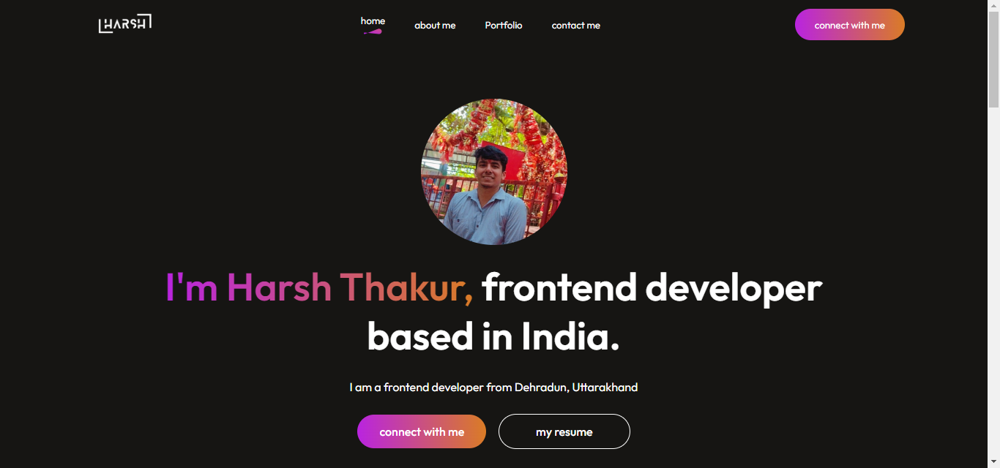
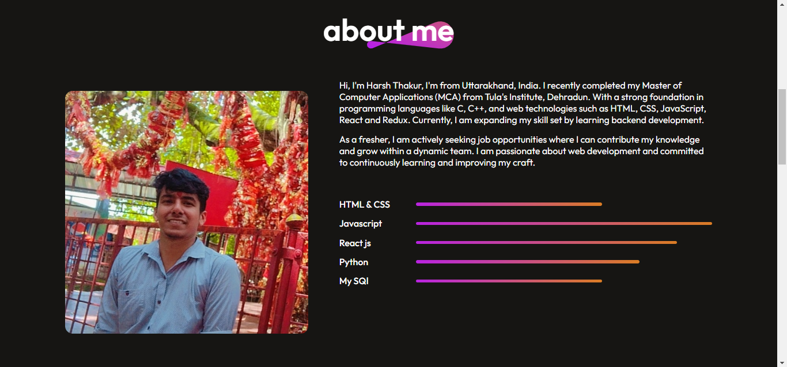
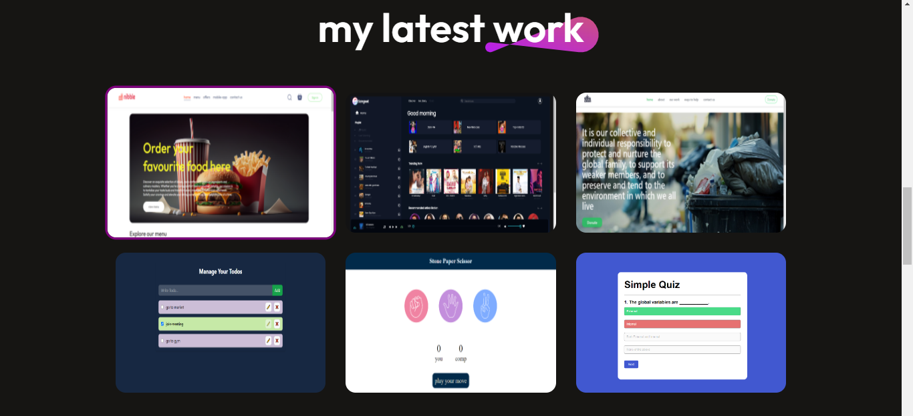
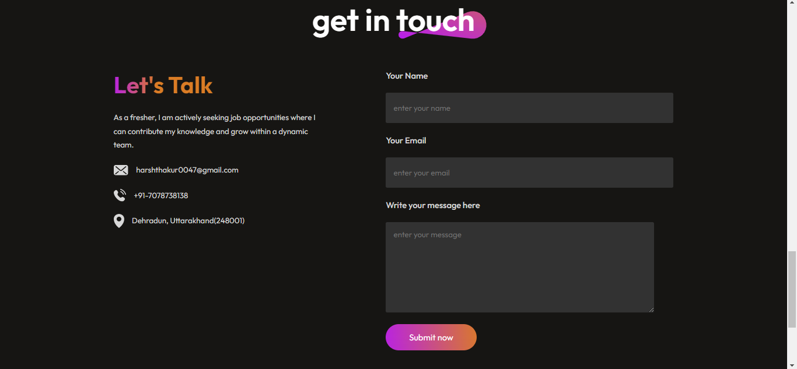

## Overview

Welcome to my portfolio website! This site showcases my skills, projects, and experience as a frontend developer. It is designed to provide potential employers and collaborators with an insight into my work and expertise in modern web development technologies.

## Screenshots

## Features

- **Responsive Design**: Optimized for viewing on all devices.
- **Project Showcase**: Displays a collection of my key projects with descriptions, technologies used.
- **About Me**: A section dedicated to introducing myself, my background, and my skills.
- **Contact Form**: An integrated form for visitors to reach out to me directly.
- **Interactive UI**: Smooth navigation and animations for an engaging user experience.

## Technologies Used

- **React**: A JavaScript library for building user interfaces.
- **HTML5 & CSS3**: The foundational web technologies for structuring and styling the content.
- **Redux**: A state management tool to manage the application's state efficiently.

## Contributing

This portfolio is a personal project, and while contributions are not currently open, I welcome feedback and suggestions. Feel free to reach out to me through the contact form on the site.
